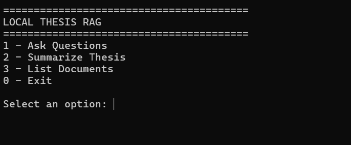
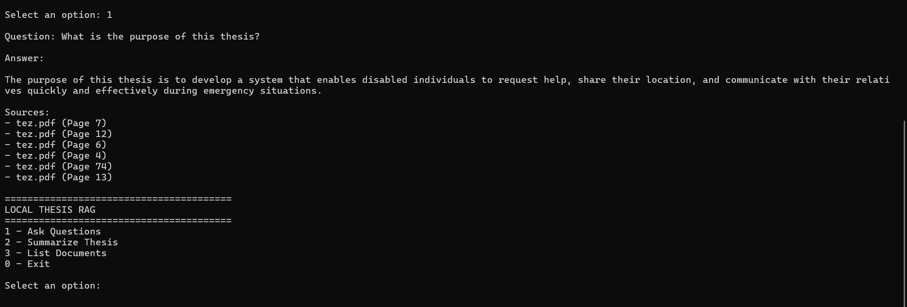
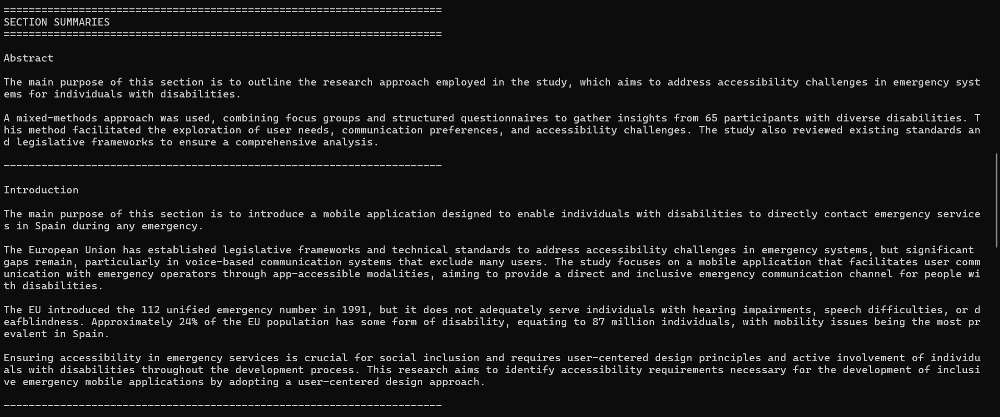
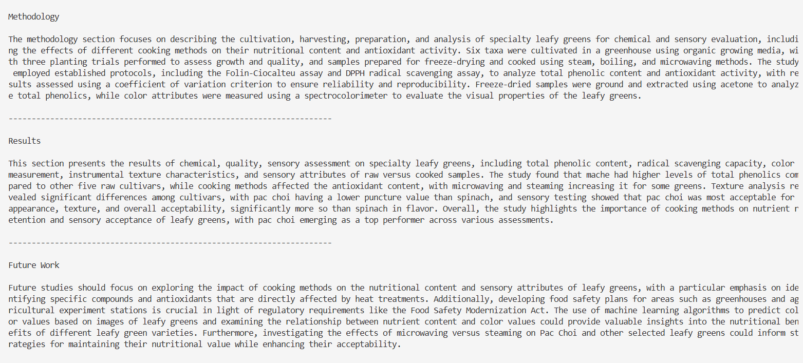
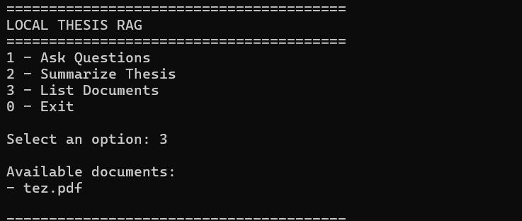

# CLI Thesis Analysis RAG

A command-line application for analyzing thesis documents using Retrieval-Augmented Generation (RAG), layout-aware document parsing, and local Large Language Models.

The application automatically extracts the structural sections of a thesis, maps them into canonical thesis sections, generates concise summaries for each section, and allows users to ask questions about indexed documents using a local LLM.

---

## Overview

Traditional RAG applications typically treat PDF documents as plain text. This project takes a structure-aware approach by preserving the logical organization of academic theses before performing summarization.

The application first analyzes the document layout using Docling, detects thesis sections, maps different heading styles into canonical sections, and then summarizes each section independently. In addition, users can query indexed documents through a local Retrieval-Augmented Generation pipeline powered by Ollama and ChromaDB.

All processing is performed locally without relying on cloud-based AI services.

---

## Features

- Local RAG with Ollama
- Multi-PDF indexing
- Document-specific question answering
- Automatic thesis section detection
- Section-wise summarization using Docling
- ChromaDB vector search
- Source page references

---

## Architecture

```text
                 PDF Documents
                       │
                       ▼
                Docling Parser
                       │
                       ▼
             Section Extraction
                       │
                       ▼
              Section Mapping
               ┌───────────────┐
               │               │
               ▼               ▼
      Section Summarizer   ChromaDB
               │               │
               ▼               ▼
     Section Summaries    MMR Retrieval
                               │
                               ▼
                     Question Answering
```

---

## Technologies

- Python
- LangChain
- Ollama
- ChromaDB
- Docling
- PyPDF
- Llama 3.2
- Maximum Marginal Relevance (MMR)

---

## Project Structure

```text
local-docs-rag/
│
├── docs/
├── src/
│   ├── config/
│   ├── parsers/
│   ├── section_mapper.py
│   ├── thesis_summarizer.py
│   ├── vector_store.py
│   └── ...
│
├── tests/
├── main.py
├── index.py
├── requirements.txt
└── README.md
```

---

## Installation

Clone the repository:

```bash
git clone https://github.com/gizemyalcinn/local-docs-rag.git
cd local-docs-rag
```

Create a virtual environment:

```bash
python -m venv .venv
```

Activate the virtual environment.

Windows:

```bash
.venv\Scripts\activate
```

Install dependencies:

```bash
pip install -r requirements.txt
```

Install Ollama and download the language model:

```bash
ollama pull llama3.2:3b
```

---

## Index Documents

Place one or more PDF files inside the `docs` directory.

Build the vector database:

```bash
python index.py
```

---

## Run

```bash
python main.py
```

The application provides the following CLI:

```text
========================================
THESIS ANALYZER
========================================

1 - Ask Questions
2 - Summarize Thesis
3 - List Documents
0 - Exit
```

---

## Sample Output

### CLI Menu

<p align="center">
  
</p>

### Question Answering

<p align="center">
  
</p>

### Section Summarization

<p align="center">
  
</p>

<p align="center">
  
</p>

### Available Documents

<p align="center">
  
</p>

### Question Answering

```text
Question:
What is the purpose of this research?

Answer:

The purpose of this research is to develop an accessible emergency support system for individuals with disabilities by integrating embedded hardware, a mobile application, and deep learning-based siren detection.

Sources:

- thesis.pdf (Page 12)
- thesis.pdf (Page 18)
```

### Section Summarization

```text
SECTION SUMMARIES

Abstract

This study presents an accessible emergency support system for individuals with disabilities by integrating embedded hardware, a mobile application, and a deep learning-based siren detection model. The proposed solution enables users to send emergency messages together with their location while automatically detecting nearby siren sounds. Experimental results demonstrate that the system can successfully detect sirens in real-time and provide reliable emergency notifications.

----------------------------------------------------------------------
```

---

## Example Workflow

1. Place thesis PDF files into the `docs` directory.
2. Build the vector database by running `python index.py`.
3. Start the application using `python main.py`.
4. Ask questions about indexed documents or generate section-wise summaries.

---

## License

This project was developed for educational and portfolio purposes.
